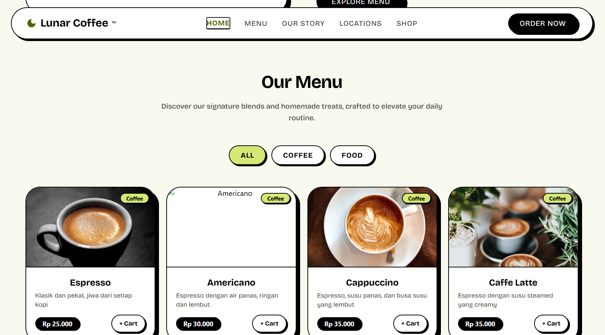

<div align="center">
  <h1>☕ Lunar Coffee</h1>
  <p><strong><em>Brewed for the Stars</em></strong></p>
  <p>
    
    
    
    
  </p>
  <br>
</div>

**Lunar Coffee** adalah website profil untuk brand kopi premium bertema luar angkasa. Dibangun dengan React + Vite + Tailwind CSS v4, menampilkan desain *Neubrutalism* yang bold, energik, dan modern.

---

## ✨ Fitur & Halaman

| Halaman | Deskripsi |
|---|---|
| **🏠 Home** | Hero section dengan tagline *"Brewed for the Stars"*, menu unggulan, tentang kami, dan berita terbaru |
| **📋 Menu** | 20 item menu (kopi & makanan) dengan gambar, deskripsi, harga (IDR), filter kategori, dan tombol *Add to Cart* |
| **📖 Our Story** | Cerita brand, 3 statistik (50+ varian kopi, 10K+ pelanggan, 5 cabang) |
| **📍 Locations** | 3 lokasi di Banda Aceh dengan peta Google Maps embedded |
| **🛒 Shop** | Keranjang belanja dengan sistem checkout multi-step: pilih metode pembayaran (Cash / QRIS / E-Wallet) |

### 🧩 Komponen Utama
- **Navbar** — navigasi sticky dengan link halaman
- **Hero** — headline besar + badge animasi + CTA
- **MenuSection** — grid menu dengan filter & cart
- **AboutSection** — brand story + statistik
- **NewsSection** — blog cards (*Lunar Chronicles*)
- **LocationsSection** — 3 cabang + Google Maps embed
- **ShopSection** — cart & checkout flow (Cash, QRIS, E-Wallet)
- **Footer** — navigasi, kebijakan privasi, copyright

---

## 🖼️ Tampilan Website

### Hero Page
Halaman utama menampilkan hero *"Brewed for the Stars"*, badge premium floating, dan tombol **Explore Menu**. Di bawahnya terdapat grid menu unggulan, stories, dan berita.

### Menu

Grid 20 item kopi & makanan dengan filter **All / Coffee / Food**. Setiap kartu menampilkan gambar dari Unsplash, harga dalam IDR, dan tombol **Add to Cart**.

### Shop / Checkout
Sistem checkout multi-step:
1. **Cart** — Atur jumlah item, lihat total harga
2. **Pilih Pembayaran** — Cash, QRIS (QR Code inline), atau E-Wallet (GoPay, OVO, Dana, ShopeePay, LinkAja)
3. **Konfirmasi** — Tampilan sukses setelah pembayaran

### Our Story
Halaman brand story dengan 3 statistik: **50+** varian kopi, **10K+** pelanggan puas, **5** cabang di Banda Aceh.

### Locations
3 lokasi dengan alamat, jam operasional, dan Google Maps yang bisa diinteraksi.

---

## 🛠️ Tech Stack

| Teknologi | Kegunaan |
|---|---|
| **React 19** | Framework UI |
| **Vite 8** | Build tool & dev server (HMR cepat) |
| **Tailwind CSS 4** | Utility-first styling |
| **Oxlint** | Linter (pengganti ESLint) |
| **Google Fonts** | Bricolage Grotesque & Inter |
| **Material Symbols** | Icon set |

---

## 🚀 Cara Menjalankan

### Prasyarat
- **Node.js** v18+ (disarankan v20+)
- **npm** v9+ (bawaan Node.js)

### Langkah-langkah

```bash
# 1. Clone repositori
git clone https://github.com/chusnulzamzami/AIVC_Frontend_Web_UMKM_Coffe.git
cd AIVC_Frontend_Web_UMKM_Coffe

# 2. Install dependencies
npm install

# 3. Jalankan development server
npm run dev
```

Buka `http://localhost:5173` di browser.

### Build Production

```bash
npm run build      # Hasil di folder `dist/`
npm run preview    # Preview hasil build
```

### Linting

```bash
npm run lint
```

---

## 📁 Struktur Proyek

```
AIVC_Frontend_Web_UMKM_Coffe/
├── public/
│   ├── favicon.svg
│   └── icons.svg
├── src/
│   ├── assets/
│   │   └── hero.png
│   ├── App.jsx          # Komponen utama (semua halaman)
│   ├── main.jsx         # Entry point React
│   └── index.css        # Tailwind + custom theme
├── index.html
├── package.json
├── vite.config.js
└── README.md
```

---

## 🧑‍🎨 Desain

- **Gaya:** Grass Neubrutalism — warna cerah, bayangan hitam solid tanpa blur, border tebal
- **Palette:** Latar `#F9FAEF`, aksen hijau neon `#D4E875` & `#9DE85B`, biru pastel `#D4EBF8`, teks & shadow hitam pekat
- **Font:** Bricolage Grotesque (variable 200–800)
- **Animasi:** Floating badge, scroll reveal, hover press effect

---

<div align="center">
  <sub>Dibuat dengan ❤️ untuk UMKM Kopi di Banda Aceh</sub>
  <br>
  <sub>© 2025 Lunar Coffee</sub>
</div>
